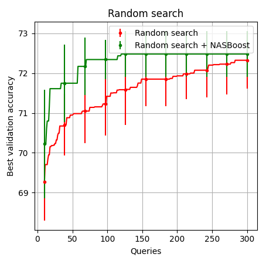
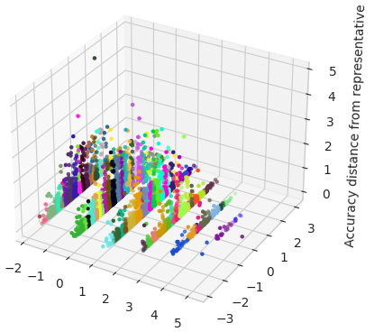

# NASBoost
This repository contains the official code for the following paper:
```bibtex
FILL HERE
```

We fork the implementations of [naszilla](https://github.com/naszilla/naszilla) repository,
which includes the official implementation of the following papers:
<table>
 <tbody>
    <tr align="center" valign="bottom">
      <th>Paper</th>
      <th>Blog Post</th>
    </tr>
    <tr> <!-- (1st row) -->
    <td rowspan="1" align="center" valign="middle" halign="middle"> <a href="https://arxiv.org/abs/2007.04965" target="_blank">A Study on Encodings for Neural Architecture Search</a> </td>
    <td align="center" valign="middle"> <a href="https://abacus.ai/blog/2020/10/02/a-study-on-encodings-for-nas/" target="_blank">Blog Post</a> </td>
    </tr>
    <tr> <!-- (2nd row) -->
    <td rowspan="1" align="center" valign="middle" halign="middle"> <a href="https://arxiv.org/abs/1910.11858" target="_blank">BANANAS: Bayesian Optimization with Neural Architectures for Neural Architecture Search</a> </td>
    <td align="center" valign="middle"> <a href="https://medium.com/reality-engines/bananas-a-new-method-for-neural-architecture-search-192d21959c0c" target="_blank">Blog Post</a> </td>
    </tr>
    <tr> <!-- (3rd row) -->
    <td rowspan="1" align="center" valign="middle" halign="middle"> <a href="https://arxiv.org/abs/2005.02960" target="_blank">Exploring the Loss Landscape in Neural Architecture Search</a> </td>
    <td align="center" valign="middle"> <a href="https://abacus.ai/blog/local-search-is-state-of-the-art-for-neural-architecture-search-benchmarks/" target="_blank">Blog Post</a> </td>
    </tr>
 </tbody>
</table>

## Installation
Clone this repository and install its requirements (which includes [nasbench](https://github.com/google-research/nasbench), 
[nas-bench-201](https://github.com/D-X-Y/NAS-Bench-201), and [nasbench301](https://github.com/automl/nasbench301)). 
It may take a few minutes.
```bash
git clone https://github.com/dani3l125/NASBoost
cd NASBoost
cat requirements.txt | xargs -n 1 -L 1 pip install
pip install -e .
```

Next, download the nas benchmark dataset we use (either with the terminal command below,
or from their website)
[nas-bench-201](https://github.com/D-X-Y/NAS-Bench-201).

```bash
# these files are 0.5GB, 2.1GB, and 1.6GB, respectively
wget https://ndownloader.figshare.com/files/25506206?private_link=7d47bf57803227af4909 -O NAS-Bench-201-v1_0-e61699.pth
```
Place the downloaded benchmark data file in `~/nas_benchmark_datasets` (or choose
another directory and edit line 15 of `naszilla/nas_benchmarks.py` accordingly).

Now you have successfully installed all the requirements to reproduce our experiments and visualizations.

### Running experiments

To reproduce the results we present, define a `config.yaml` file with the parameters that matches the desired experiment.
For example, the following commands will reproduce the results for random search given the initial configuration:
```bash
cd naszilla
python naszilla/run_experiments.py --search_space nasbench_201 --algo_params random --queries 300 --trials 10 --k_alg 1 --cfg
'naszilla/knas_config.yaml' --dataset cifar10
python naszilla/run_experiments.py --search_space nasbench_201 --algo_params random --queries 300 --trials 10 --k_alg 1 --cfg
'naszilla/knas_config.yaml' --dataset cifar100
python naszilla/run_experiments.py --search_space nasbench_201 --algo_params random --queries 300 --trials 10 --k_alg 1 --cfg
'naszilla/knas_config.yaml' --dataset ImageNet16-120

```


These experiments should finish running within a few minutes.

## Run Visualization


To reproduce the study visualizations we reported, run the script `visualize.py`. You may want to change the zoom in `CLUSTERS` constant.

## Citation
Please cite our paper if you use code from this repo:
```bibtex
FILL HERE
```
